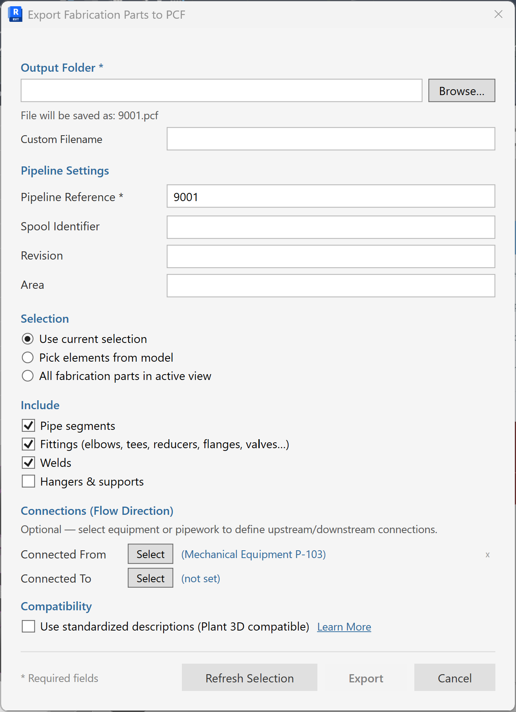
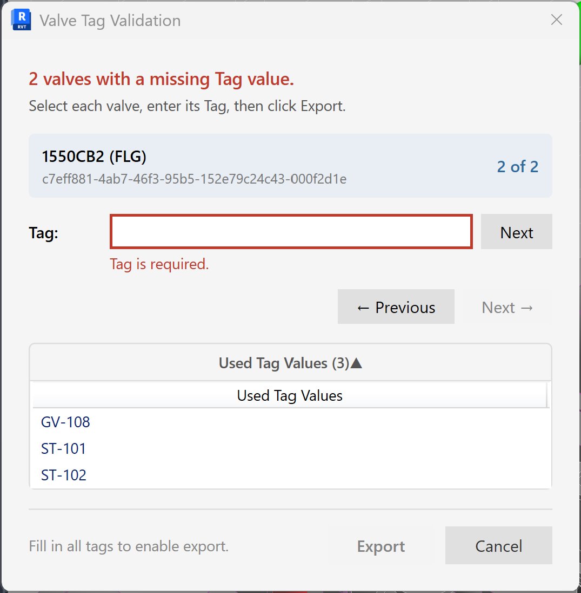
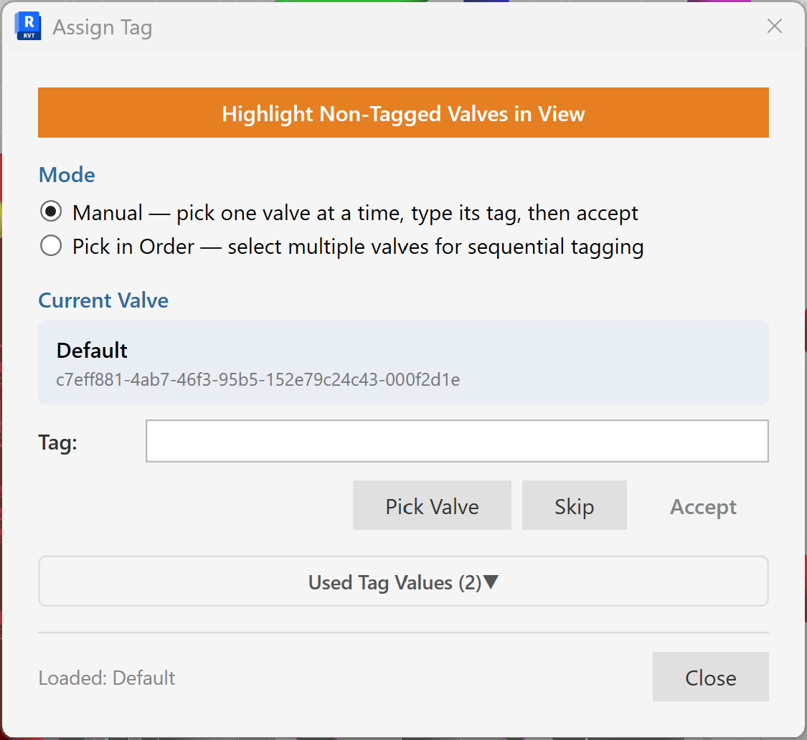

# User guide

A walkthrough of every part of the add-in. Read top-to-bottom on first use; jump to a section later.

> **Disclaimer.** This code is provided by Autodesk for evaluation purposes only, as an example of what is possible with the Autodesk platform and APIs. THIS CODE IS NOT INTENDED FOR USE IN PRODUCTION. Autodesk makes no representations, warranties, or commitments about the code. This code is not fully tested and may include errors or faults that may cause total data loss or system failure.

---

## What this add-in is for

Two commands, both centred on getting Autodesk MEP Fabrication parts into a **PCF** file (Piping Component File) that downstream ISOGEN / Plant 3D / other piping tools can consume:

- **ITMs to PCF** — the exporter. Turns your selected fabrication parts into a PCF file.
- **Assign Tag** — the prep. Interactively assigns Tag values to fabrication valves so they'll survive the export's tag-uniqueness check.

Neither command modifies your model geometry. Assign Tag writes the `Tag` parameter on valves (that's its whole job); the exporter writes a text file (`.pcf`) to disk.

---

## Ribbon

After installation, look for the **PCF Export** tab in the Revit ribbon. The single **Export** panel hosts two flat buttons:

| Button | What it does |
|---|---|
| **ITMs to PCF** | Export selected Fabrication Parts to a PCF file. |
| **Assign Tag** | Interactively tag Fabrication valves. |

---

# One-time project setup — required parameters

Before the exporter can do its job, two instance parameters must exist on the **MEP Fabrication Pipework** category and be reachable via `Element.LookupParameter(...)`:

| Parameter | Category | Purpose |
|---|---|---|
| **Line Number** | MEP Fabrication Pipework (instance) | The pipeline / line identifier that becomes the PCF's `PIPELINE-REFERENCE`. Also drives the initial value shown in the Export dialog's **Pipeline Reference** field. |
| **Tag** | MEP Fabrication Pipework (instance) | The unique valve / component tag written to each PCF component's `TAG` attribute. |

**Add them once per project (or in your template)** via **Manage → Project Parameters → Add**. Any storage type works as long as the parameter reads as text; a shared parameter is preferable if you want the values to travel between models or into schedules.

If either parameter is missing on the category, the exporter still runs but the values it depends on come back empty — `PIPELINE-REFERENCE` defaults to `<BLANK>` and `TAG` fields on valves come out empty, which the tag validator immediately catches.

Skipping this setup step is the single most common reason a fresh install "doesn't work right" — do it first.

---

# ITMs to PCF

The exporter. Walks selected fabrication parts, derives ISOGEN SKEYs, and writes a PCF file.

## Workflow

1. Select one or more Fabrication Pipework parts in the model.
2. On the **PCF Export** tab, click **ITMs to PCF**.
3. The **Export Options** dialog opens. As soon as it opens, every element in the active view that is *not* part of the export selection gets a temporary **85% transparency** override (see [Visual export scope](#visual-export-scope) below).
4. Review the options (defaults are usually correct), pick the output path, click **Export**.
5. If any valves in the selection are missing tags, the tag-validation dialog opens — fill them in and click **Export** again.
6. On success, a summary dialog tells you the file path and component counts.
7. The transparency overrides restore automatically the moment the dialog closes, whether you finished the export, cancelled, or closed the window.

## Visual export scope

The moment the Export dialog opens, the tool applies a per-view graphic override to help you *see* what's queued for export vs. what isn't.

- Every element in the active view of a **relevant piping / duct / equipment category** (fabrication pipework, fabrication ductwork, native pipes / ducts, pipe / duct fittings and accessories, mechanical equipment) that is **not** part of the current export selection gets rendered at **85% surface transparency**.
- Elements *in* the export selection render at full opacity as usual.
- The dim persists across the tag-validation flow — so when the Tag Validation dialog interrupts an export, you're still looking at the same visual scope.
- Adding elements to the export set clears their transparency in real time:
  - **Refresh Selection** re-reads the current Revit selection; newly-added elements un-dim, removed ones re-dim.
  - **Pick Elements** replaces the export set entirely; the dim reconciles to match.
  - **Connected From** / **Connected To** un-dims the picked target so it's fully visible alongside the rest of the export.
- On any dialog close (Export success, Cancel, or window X), every override is cleared and the view returns to its normal appearance.

If the active view can't accept element overrides (schedules, sheets), the tool silently skips the dim — nothing breaks, you just don't get the visual cue.

## Export Options dialog

The dialog is grouped into collapsible sections. Most defaults are safe.

### Output

- **PCF file path** — where the `.pcf` file gets written. Defaults to `<model-folder>\<model-name>.pcf`. Change via the **Browse…** button.
- **PCF version** — target ISOGEN version. Defaults to the newest widely-compatible version. Change only if a downstream tool insists on a specific version.

### Header

- **PROJECT-IDENTIFIER** — free-text project name written into the PCF header. Defaults to the Revit model name.
- **PIPELINE-REFERENCE** — the pipeline / line-number string written into the PIPELINE-COMPONENT block. **Auto-populated from the Line Number parameter on the selected MEP Fabrication Pipework** — see the section immediately below.

#### How Pipeline Reference gets its value

When you open the Export dialog, the tool reads the **Line Number** parameter on every selected MEP Fabrication Pipework element and populates the **Pipeline Reference** field for you:

- **One selected pipe run with a Line Number populated** — the field shows that value directly. Example: selecting a run tagged `1001` → the field shows `1001`.
- **One or more selected pipes with no Line Number set** — the field shows `<BLANK>`. That's the exporter's explicit sentinel for "no line number here"; it goes into the PCF as-is if you don't override.
- **Multiple pipe runs with different Line Numbers selected** — the field shows every distinct value, comma-separated. Example: selecting parts from lines `1001` and `1002` in one selection → the field shows `1001, 1002`.
- **Mixed — some pipes have a Line Number, some don't** — the missing ones contribute `<BLANK>` to the list. Example: three runs where two are tagged `1001` and one is unset → the field shows `1001, <BLANK>`.

You can edit the field freely before clicking Export. Overriding it here doesn't write back to the Revit parameter — the change is scoped to this export.

This behaviour is why the [one-time project setup](#one-time-project-setup--required-parameters) step matters: with **Line Number** provisioned on your Fabrication Pipework and populated on real pipes, the Pipeline Reference lands correctly with zero manual entry. Without it, every export starts with `<BLANK>` and you retype the value each time.

### Materials

- **Emit MATERIALS block** — include the material catalog at the top of the PCF. Turn off if your downstream tool doesn't consume it.
- **Material overrides** — a small table letting you override the material spec on a per-service basis. Useful when the fabrication service name doesn't match what your ISOGEN template expects.

### Identity Data

- **Tag parameter** — which Revit parameter on the fab part holds the valve Tag value. Defaults to the built-in `Tag`. Override for custom parameter setups.
- **SKEY parameter** — where the SKEY override lives. The exporter derives the SKEY automatically for most component types; setting a value on this parameter forces a specific SKEY.

### Insulation

- **Emit ATTRIBUTE INSULATION lines** — include insulation thickness / material per component. Turn off if the model has no insulation data or if the downstream template ignores it.

### Supports

- **Include pipe supports** — write hanger / support components as PCF `SUPPORT` entries. On by default.

### Connections (Flow Direction)

Optional. Lets you tell downstream ISOGEN / Plant 3D what sits **upstream** and **downstream** of the exported spool — so the iso shows correct flow direction and terminates at real system endpoints instead of orphaned pipe ends.

- **Connected From** — click **Select**, then pick one element in the Revit view that represents the upstream side (typically a pump, tank, or manifold, or another pipe run that continues out of frame). The selected element's identifier appears next to the button; click the small **×** to clear.
- **Connected To** — same, for the downstream side.

The picker accepts two element types and behaves differently for each:

| Selected element type | Emitted as | Reference value comes from |
|---|---|---|
| **Mechanical Equipment** | `END-CONNECTION-EQUIPMENT` | The element's **Tag** parameter (Identity Data group), falling back to **Mark** if Tag is empty. If both are empty, a tag-validation dialog opens so you can assign one inline — the value gets written back to the equipment. |
| **MEP Fabrication Pipework** | `END-CONNECTION-PIPELINE` | The element's **Line Number** parameter. If Line Number is empty, you get a "Missing Line Number" prompt — you can either proceed with a blank reference or cancel and populate the parameter first. |

Leaving both fields blank is fine — the PCF just won't emit `END-CONNECTION` markers, and the downstream tool will draw the spool with open ends.

**Why bother?** The isometric renderer uses these markers to place equipment glyphs and line-number tags at the correct end of the spool. Without them, a spool that continues from one iso sheet to the next has to be manually cross-referenced. Populating Connected From / Connected To lets the downstream tool do that automatically.

### Compatibility

Controls PCF text-formatting details that specific downstream tools care about.

- **Use standardized descriptions (Plant 3D compatible)** — reformats each component's `ITEM-DESCRIPTION` line to follow the naming convention that Autodesk Plant 3D's PCF-to-Pipe importer expects. When on, descriptions read as `ELBOW 90 4"` / `TEE 4"x4"x2" REDUCING` / `VALVE GATE 6" 150#` — a canonical structure the Plant 3D catalog matcher recognises. When off, descriptions are the raw strings the fabrication catalog reports, which can be more descriptive but confuse Plant 3D.

Turn this on when your downstream consumer is Plant 3D. Leave it off when the consumer is a text-based ISOGEN template or another tool that reads the description as-is.

The **Learn More** link next to the checkbox opens the [Plant 3D PCF-to-Pipe compatibility notes](https://github.com/sbuchanan01/pcf-export-for-revit/blob/main/docs/user-guide.md#compatibility) — a summary of which catalog quirks the standardized-descriptions mode papers over.

### Output preview

At the bottom, the dialog shows a live count of what will be exported: pipes, elbows, tees, reducers, olets, valves, welds, caps, unions, flanges, end connections, supports.

## Tag validation

When you click **Export**, the tool scans every valve in the selection and checks:

- Every valve has a `Tag` value.
- No two valves share the same `Tag`.

If either check fails, the **Valve Tag Validation** dialog opens. It shows one missing / duplicate valve at a time.

- **Tag** field — enter the new tag. Uppercase is enforced.
- **Next** (beside the Tag field) — auto-fills the next open number using the pattern of the most recently entered tag (e.g. `V-001` → `V-002` → `V-003`, skipping numbers already used).
- **Show** — zooms the active Revit view to the current valve and selects it. Useful when the valve isn't visible in the current view frame and you need to see what you're tagging before typing anything. Silently no-ops if the element isn't visible in any open view (e.g. it's hidden by a section box).
- **← Previous / Next →** — walk between missing / duplicate items.
- **Used Tag Values** (collapsible) — shows tags already in use, so you don't accidentally pick a duplicate you can't see.
- **Export** — greyed out until every item has a unique tag. Click when ready to complete the export.
- **Cancel** — bails without writing the PCF; your existing tag entries in the model are still saved from any prior partial run.

Once every valve validates, the PCF file gets written and a summary dialog tells you the counts.

---

# Assign Tag

Companion command for **prep** work — tagging fabrication valves interactively so they'll survive the exporter's tag-uniqueness check.

The dialog is **modeless**, so you can pan, zoom, and select valves in the Revit view while it's open.

## Workflow

1. On the **PCF Export** tab, click **Assign Tag**.
2. The **Assign Tag** dialog opens (modeless).
3. Pick one of the workflows below.

## Three ways to use it

### Single tag

1. In the model, select one Fabrication valve.
2. In the dialog, type the tag into the **Tag** field.
3. Click **Set Tag** (or press <kbd>Enter</kbd>). The value writes to the valve's Tag parameter.

### Auto-incrementing sequence

Use when you're tagging a run of valves in order.

1. In the **Prefix** field, enter the base string (e.g. `V-`).
2. In the **Start #** field, enter the starting number (e.g. `1`).
3. In the **Digits** field, enter the zero-padding width (e.g. `3` for `V-001`).
4. Click **Pick Next Valve**. The cursor turns into the Revit pick tool.
5. Pick a valve in the view. The next number in the sequence gets written to its Tag. Repeat.

The dialog remembers the last number used, so you can pick valves in any order and the numbering stays contiguous.

### Highlight all untagged

Use when you need to see what's still missing.

- Click **Highlight Untagged in View**. Every Fabrication valve in the active view that has no Tag value gets selected. Zoom to the selection with <kbd>Z</kbd><kbd>S</kbd> to find them visually.

## Notes

- The dialog stays on top of Revit while open. Close it via the **X** or **Close** button.
- Only Fabrication category members (`OST_FabricationPipework`) with a valve part type are touched; other elements are ignored even if picked.

---

## Troubleshooting

- **Export button in the dialog is greyed out** — you have no selection, or the selection contains no Fabrication parts. Cancel, select some fabrication pipes/fittings/valves, and re-run.
- **"Tag is required" or "Tag already used"** — the tag validator caught a missing or duplicate value. Fix in the dialog and click Export again.
- **PCF opens but downstream tool complains about a component** — copy the offending line's SKEY out of the PCF and look it up in your downstream template's supported-SKEY list. If the SKEY looks wrong for the component type, override via the SKEY parameter on the part in Revit and re-export.
- **Some valves didn't get exported** — check they're actually in the selection and are `OST_FabricationPipework` category members (not native Revit pipe accessories).

---

## License

MIT — see [LICENSE](../LICENSE).
